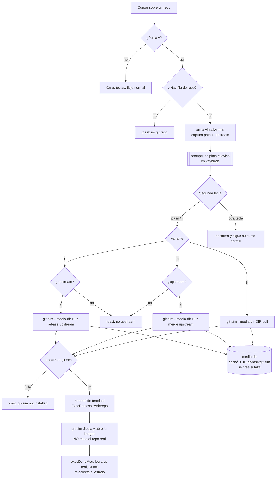

# Flujo de la feature — Preview visual con git-sim

Derivado de `behavior.feature`. Camino paralelo al selector de `p`.

```mermaid
flowchart TD
    A[Cursor sobre un repo] --> B{¿Pulsa v?}
    B -- no --> Z[Otras teclas: flujo normal]
    B -- sí --> C{¿Hay fila de repo?}
    C -- no --> T1[toast: no git repo]
    C -- sí --> D[arma visualArmed<br/>captura path + upstream]
    D --> E[[promptLine pinta el aviso<br/>en keybinds]]

    E --> K{Segunda tecla}
    K -- "p / m / r" --> V{variante}
    K -- otra tecla --> X[desarma y sigue su curso normal]

    V -- p --> P1[git-sim --media-dir DIR pull]
    V -- m --> M1{¿upstream?}
    V -- r --> R1{¿upstream?}
    M1 -- no --> T2[toast: no upstream]
    R1 -- no --> T2
    M1 -- sí --> P2[git-sim --media-dir DIR merge upstream]
    R1 -- sí --> P3[git-sim --media-dir DIR rebase upstream]

    P1 --> L{LookPath git-sim}
    P2 --> L
    P3 --> L
    L -- falta --> T3[toast: git-sim not installed]
    L -- ok --> H[handoff de terminal<br/>ExecProcess cwd=repo]

    H --> W[git-sim dibuja y abre la imagen<br/>NO muta el repo real]
    W --> DONE[execDoneMsg: log argv real, Dur=0<br/>re-colecta el estado]

    P1 --> DIR[(media-dir<br/>caché XDG/gitdash/git-sim<br/>se crea si falta)]
    P2 --> DIR
    P3 --> DIR
```
