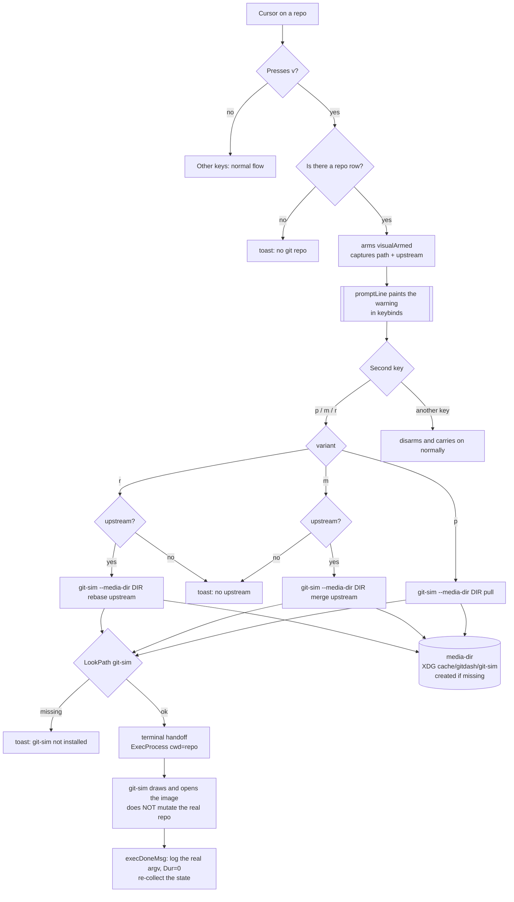

# Feature flow — Visual preview with git-sim

Derived from `behavior.feature`. A path parallel to `p`'s selector.

```mermaid
flowchart TD
    A[Cursor on a repo] --> B{Presses v?}
    B -- no --> Z[Other keys: normal flow]
    B -- yes --> C{Is there a repo row?}
    C -- no --> T1[toast: no git repo]
    C -- yes --> D[arms visualArmed<br/>captures path + upstream]
    D --> E[[promptLine paints the warning<br/>in keybinds]]

    E --> K{Second key}
    K -- "p / m / r" --> V{variant}
    K -- another key --> X[disarms and carries on normally]

    V -- p --> P1[git-sim --media-dir DIR pull]
    V -- m --> M1{upstream?}
    V -- r --> R1{upstream?}
    M1 -- no --> T2[toast: no upstream]
    R1 -- no --> T2
    M1 -- yes --> P2[git-sim --media-dir DIR merge upstream]
    R1 -- yes --> P3[git-sim --media-dir DIR rebase upstream]

    P1 --> L{LookPath git-sim}
    P2 --> L
    P3 --> L
    L -- missing --> T3[toast: git-sim not installed]
    L -- ok --> H[terminal handoff<br/>ExecProcess cwd=repo]

    H --> W[git-sim draws and opens the image<br/>does NOT mutate the real repo]
    W --> DONE[execDoneMsg: log the real argv, Dur=0<br/>re-collect the state]

    P1 --> DIR[(media-dir<br/>XDG cache/gitdash/git-sim<br/>created if missing)]
    P2 --> DIR
    P3 --> DIR
```