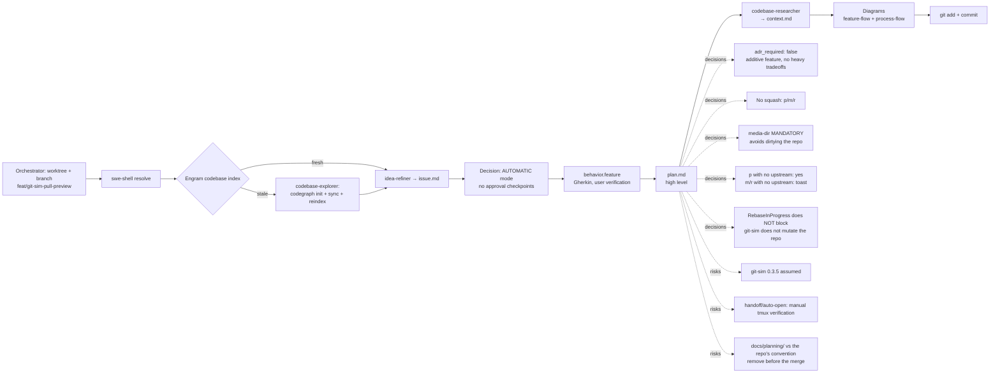

# Planning flow — `git-sim-pull-preview`

Feature-aware: the real slug and the decisions taken for THIS change.

```mermaid
flowchart LR
    S0[Orchestrator: worktree + branch<br/>feat/git-sim-pull-preview] --> S1[swe-shell resolve]
    S1 --> S2{Engram codebase index}
    S2 -- stale --> S3[codebase-explorer:<br/>codegraph init + sync + reindex]
    S2 -- fresh --> S4
    S3 --> S4[idea-refiner → issue.md]
    S4 --> S5[Decision: AUTOMATIC mode<br/>no approval checkpoints]
    S5 --> S6[behavior.feature<br/>Gherkin, user verification]
    S6 --> S7[plan.md<br/>high level]
    S7 --> S8[codebase-researcher<br/>→ context.md]
    S8 --> S9[Diagrams<br/>feature-flow + process-flow]
    S9 --> S10[git add + commit]

    S7 -.->|decisions| D1[adr_required: false<br/>additive feature, no heavy tradeoffs]
    S7 -.->|decisions| D2[No squash: p/m/r]
    S7 -.->|decisions| D3[media-dir MANDATORY<br/>avoids dirtying the repo]
    S7 -.->|decisions| D4[p with no upstream: yes<br/>m/r with no upstream: toast]
    S7 -.->|decisions| D5[RebaseInProgress does NOT block<br/>git-sim does not mutate the repo]
    S7 -.->|risks| R1[git-sim 0.3.5 assumed]
    S7 -.->|risks| R2[handoff/auto-open: manual tmux verification]
    S7 -.->|risks| R3[docs/planning/ vs the repo's convention<br/>remove before the merge]
```