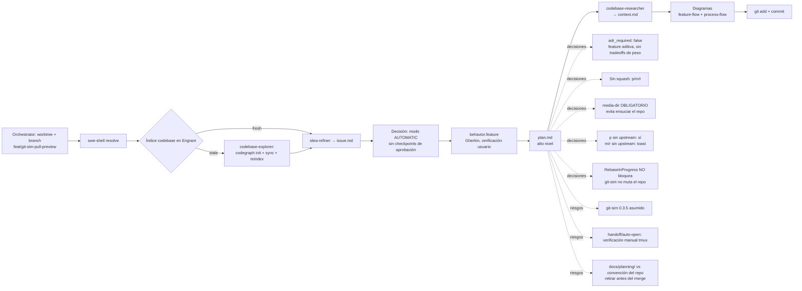

# Flujo de planificación — `git-sim-pull-preview`

Feature-aware: slug real y decisiones tomadas para ESTE cambio.

```mermaid
flowchart LR
    S0[Orchestrator: worktree + branch<br/>feat/git-sim-pull-preview] --> S1[swe-shell resolve]
    S1 --> S2{Índice codebase en Engram}
    S2 -- stale --> S3[codebase-explorer:<br/>codegraph init + sync + reindex]
    S2 -- fresh --> S4
    S3 --> S4[idea-refiner → issue.md]
    S4 --> S5[Decisión: modo AUTOMATIC<br/>sin checkpoints de aprobación]
    S5 --> S6[behavior.feature<br/>Gherkin, verificación usuario]
    S6 --> S7[plan.md<br/>alto nivel]
    S7 --> S8[codebase-researcher<br/>→ context.md]
    S8 --> S9[Diagramas<br/>feature-flow + process-flow]
    S9 --> S10[git add + commit]

    S7 -.->|decisiones| D1[adr_required: false<br/>feature aditiva, sin tradeoffs de peso]
    S7 -.->|decisiones| D2[Sin squash: p/m/r]
    S7 -.->|decisiones| D3[media-dir OBLIGATORIO<br/>evita ensuciar el repo]
    S7 -.->|decisiones| D4[p sin upstream: sí<br/>m/r sin upstream: toast]
    S7 -.->|decisiones| D5[RebaseInProgress NO bloquea<br/>git-sim no muta el repo]
    S7 -.->|riesgos| R1[git-sim 0.3.5 asumido]
    S7 -.->|riesgos| R2[handoff/auto-open: verificación manual tmux]
    S7 -.->|riesgos| R3[docs/planning/ vs convención del repo<br/>retirar antes del merge]
```
