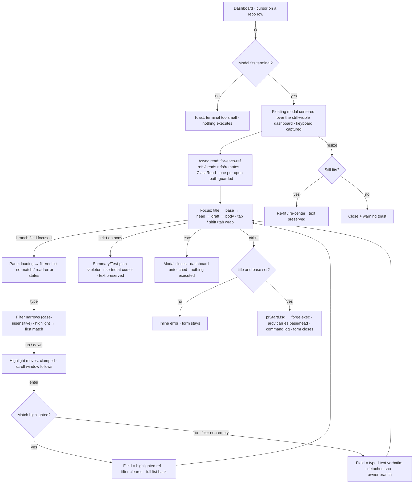

# Feature flow — PR/MR form as a floating modal with searchable branch pickers

Derived from `behavior.feature`. The dashboard never stops painting: the form is a
modal composited on top, and the branch read happens once per open.

Key rules the scenarios pin:

- head defaults to the row's branch (worktree label when there is no snapshot);
  base defaults to the sync branch.
- The head picker lists local branches only (`origin/foo` is not a valid `-H`);
  the base picker lists locals + remote-tracking refs.
- The verbatim enter (no match) is the escape hatch: read failures and exotic
  refs never block submission.
- Submit path unchanged: `forge.Params` / `BuildCreateArgv` already carry base/head.
