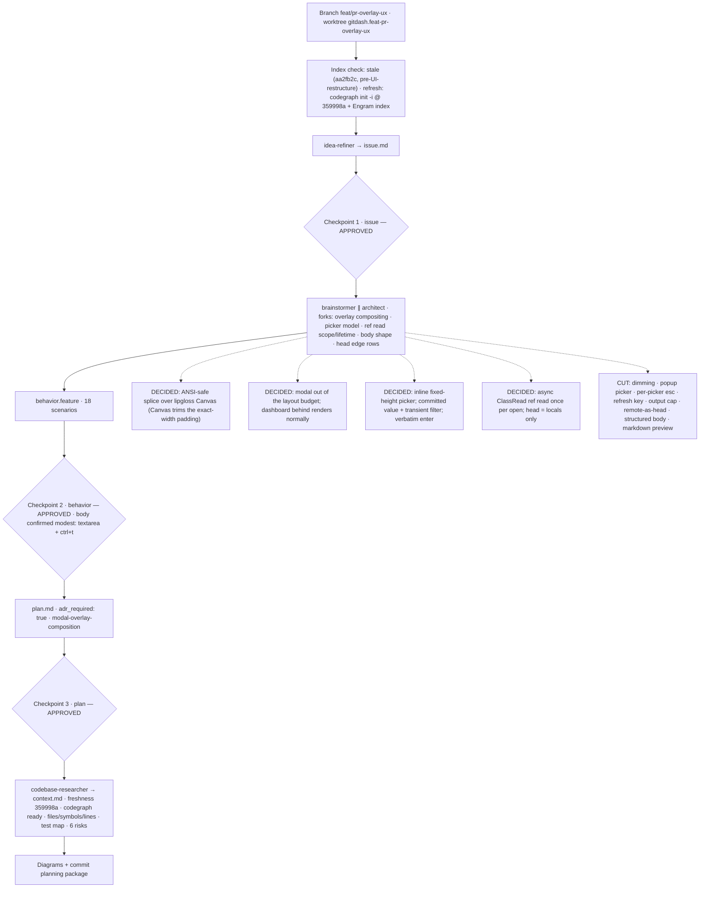

# Process flow — planning `0002-feature-pr-overlay-ux`

Feature-aware: the real slug, the checkpoints, the forks decided, and the cuts
made for THIS change.

Gate map carried into implementation:

- diff coverage 100% + mutation gate on non-draft PRs (minima as functions, pure
  helpers, conditional-free goroutine, pinned boundaries);
- `docs/FEATURES.md` updated in the same change;
- ADR `0002-modal-overlay-composition` written with the change;
- direct model tests, no teatest.
