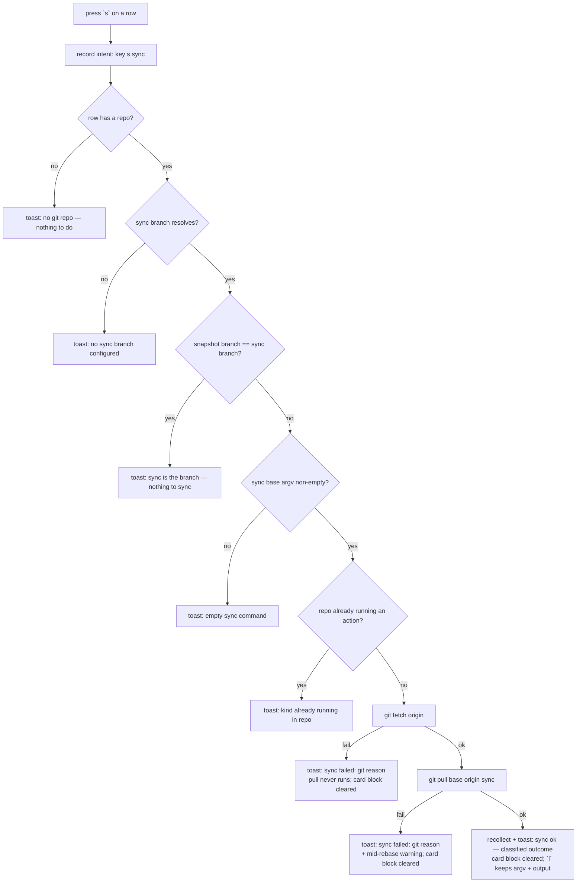

# Feature flow — `s sync`

Behavior flow derived from `behavior.feature` (17 scenarios). The intent is
recorded before any guard; each guard refuses without executing anything.

```mermaid
flowchart TD
  S["press `s` on a row"] --> I["record intent: key s sync"]
  I --> R{"row has a repo?"}
  R -- no --> T1["toast: no git repo — nothing to do"]
  R -- yes --> B{"sync branch resolves?"}
  B -- no --> T2["toast: no sync branch configured"]
  B -- yes --> SB{"snapshot branch == sync branch?"}
  SB -- yes --> T3["toast: sync is the branch — nothing to sync"]
  SB -- no --> E{"sync base argv non-empty?"}
  E -- no --> T4["toast: empty sync command"]
  E -- yes --> L{"repo already running an action?"}
  L -- yes --> T5["toast: kind already running in repo"]
  L -- no --> F["git fetch origin"]
  F -- fail --> T6["toast: sync failed: git reason<br/>pull never runs; card block cleared"]
  F -- ok --> P["git pull base origin sync"]
  P -- fail --> T7["toast: sync failed: git reason<br/>+ mid-rebase warning; card block cleared"]
  P -- ok --> OK["recollect + toast: sync ok — classified outcome<br/>card block cleared; `l` keeps argv + output"]
```
