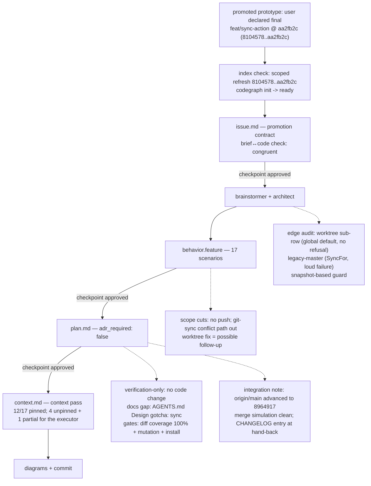

# Process flow — planning `sync-action`

Feature-aware planning flow for this promoted run: the real slug and the
decisions taken for THIS change.

```mermaid
flowchart TD
  PR["promoted prototype: user declared final<br/>feat/sync-action @ aa2fb2c (8104578..aa2fb2c)"] --> IDX["index check: scoped refresh 8104578..aa2fb2c<br/>codegraph init -> ready"]
  IDX --> ISS["issue.md — promotion contract<br/>brief↔code check: congruent"]
  ISS -->|checkpoint approved| BA["brainstormer + architect"]
  BA --> BEH["behavior.feature — 17 scenarios"]
  BEH -->|checkpoint approved| PLAN["plan.md — adr_required: false"]
  PLAN -->|checkpoint approved| CTX["context.md — context pass<br/>12/17 pinned; 4 unpinned + 1 partial for the executor"]
  CTX --> DIA["diagrams + commit"]
  BA -.-> D1["edge audit: worktree sub-row (global default, no refusal)<br/>legacy-master (SyncFor, loud failure)<br/>snapshot-based guard"]
  PLAN -.-> D2["verification-only: no code change<br/>docs gap: AGENTS.md Design gotcha: sync<br/>gates: diff coverage 100% + mutation + install"]
  PLAN -.-> D3["integration note: origin/main advanced to 8964917<br/>merge simulation clean; CHANGELOG entry at hand-back"]
  BEH -.-> D4["scope cuts: no push; git-sync conflict path out<br/>worktree fix = possible follow-up"]
```
