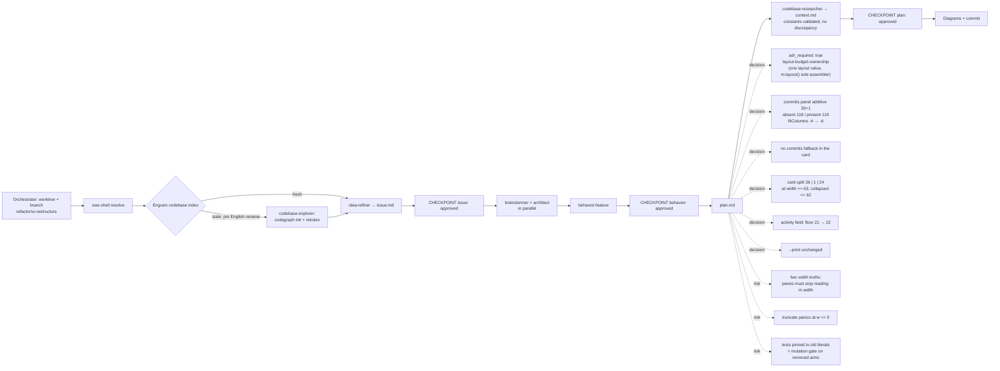

# Planning flow — `ui-restructure`

Feature-aware: the real slug and the decisions taken for THIS change.

```mermaid
flowchart LR
    S0[Orchestrator: worktree + branch<br/>refactor/ui-restructure] --> S1[swe-shell resolve]
    S1 --> S2{Engram codebase index}
    S2 -- "stale: pre English rename" --> S3[codebase-explorer:<br/>codegraph init + reindex]
    S2 -- fresh --> S4
    S3 --> S4[idea-refiner → issue.md]
    S4 --> S5[CHECKPOINT issue: approved]
    S5 --> S6[brainstormer + architect<br/>in parallel]
    S6 --> S7[behavior.feature]
    S7 --> S8[CHECKPOINT behavior: approved]
    S8 --> S9[plan.md]
    S9 --> S10[codebase-researcher → context.md<br/>constants validated, no discrepancy]
    S10 --> S11[CHECKPOINT plan: approved]
    S11 --> S12[Diagrams + commit]

    S9 -.->|decision| D1["adr_required: true<br/>layout-budget-ownership<br/>(one layout value, m.layout() sole assembler)"]
    S9 -.->|decision| D2["commits panel additive 30+1<br/>absent 118 / present 119<br/>fitColumns -4 → -6"]
    S9 -.->|decision| D3[no commits fallback in the card]
    S9 -.->|decision| D4["card split 36 | 1 | 24<br/>at width >= 63; collapsed <= 62"]
    S9 -.->|decision| D5["activity field: floor 21 → 22"]
    S9 -.->|decision| D6[--print unchanged]
    S9 -.->|risk| R1[two width truths:<br/>panes must stop reading m.width]
    S9 -.->|risk| R2[truncate panics at w <= 0]
    S9 -.->|risk| R3[tests pinned to old literals<br/>+ mutation gate on removed arms]
```
