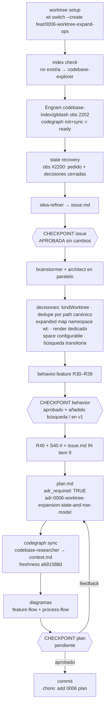

# Process flow — planning 0006-feature-worktree-expand-ops

Flujo de planificación con las decisiones reales de ESTE cambio.

Decisiones clave registradas para este cambio:
- `adr_required: true` (modelo de datos de persistencia + modelo de filas con alternativas descartadas).
- Scope cuts: sin estado git por worktree; sin tocar discovery/gitstatus/group/print; sin nuevas acciones.
- Riesgo principal: render dedicado de sub-fila (snapshot vacío mentiría).
